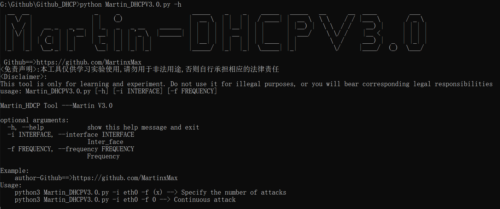
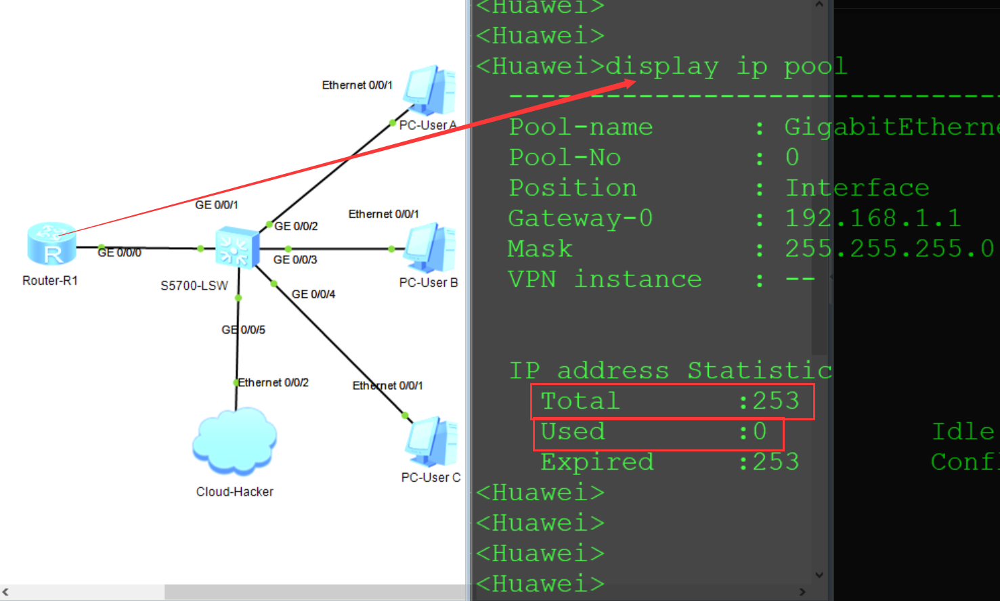
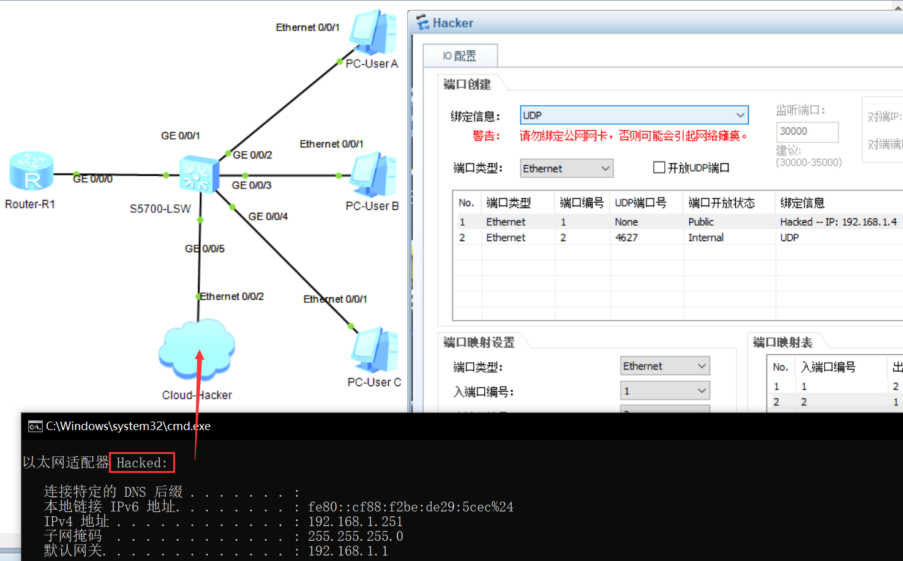
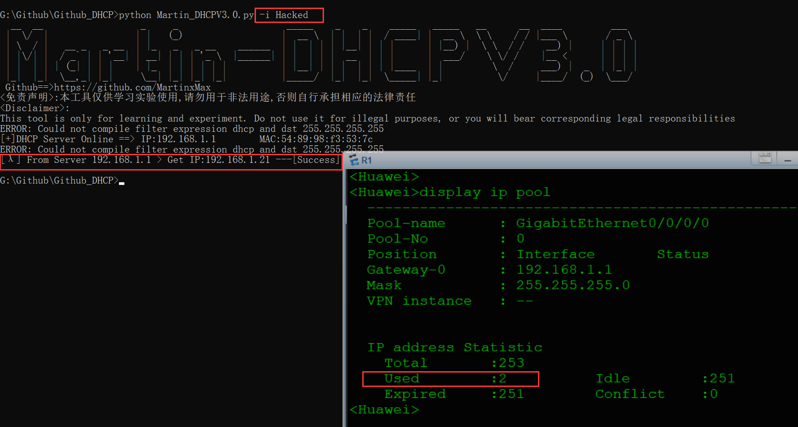
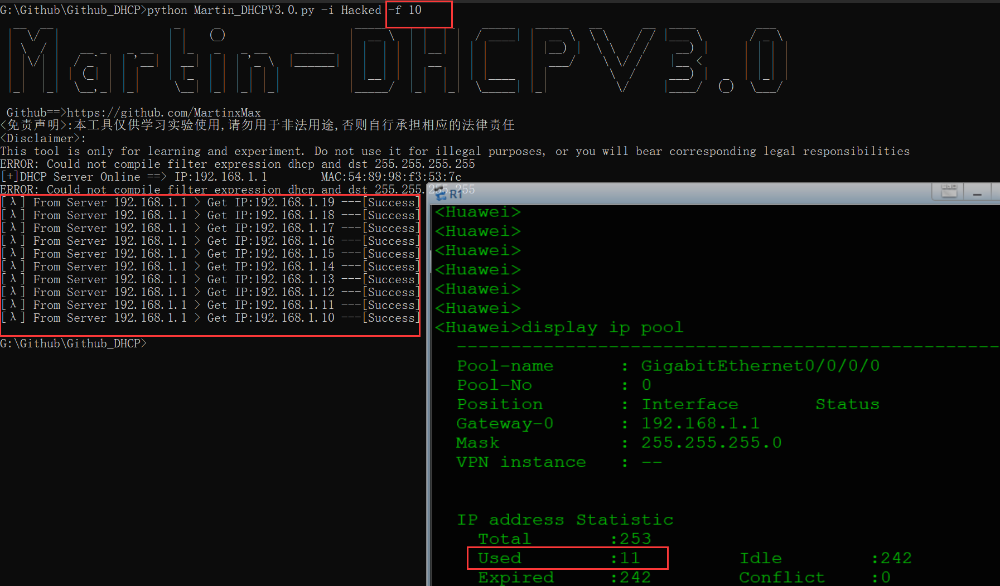
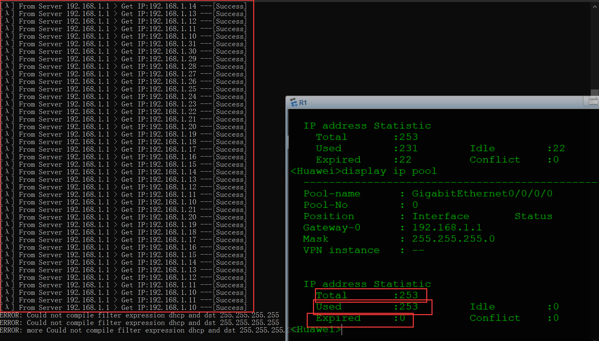

 <div align="center">
 
 <p align="center">
 
 
 
  
 
 
 </p>
  
 <table>
  <tr>
      <th>Function</th>
  </tr>
  <tr>
    <th>DHCP Starvation Attacks</th>
  </tr>
 </table>
</div>

## usage method
  * View help information

      ```#python3 MDPG.0.py -h```

    

  * Build an intranet model

    * _Normal IP pool usage is 0_

  

  * Get network interface

  

  * Direct use without parameters

  

  * Specify the number of attacks

  


* Continuous attack

  


